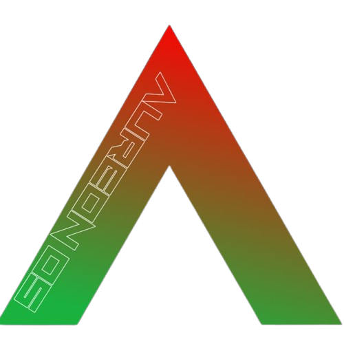
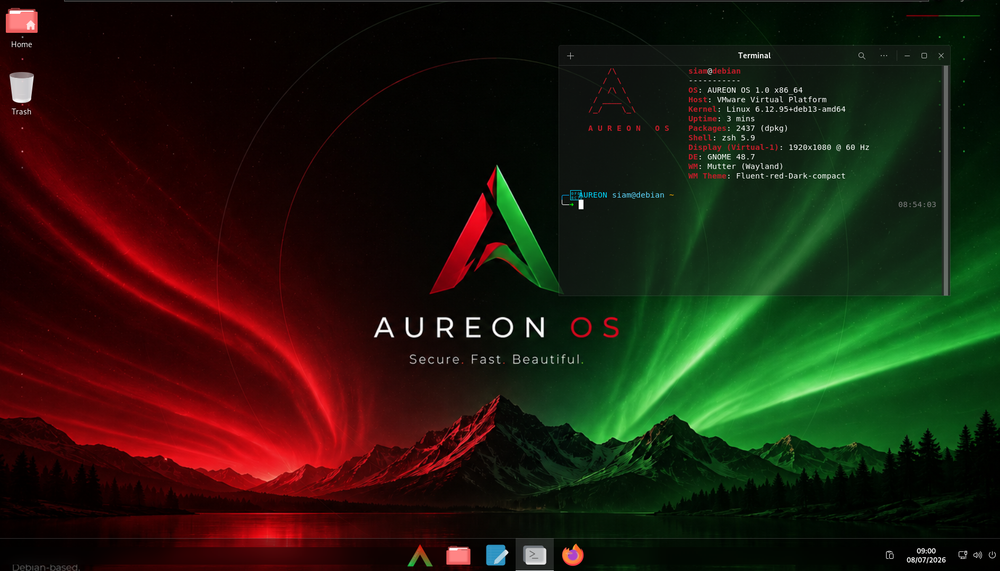
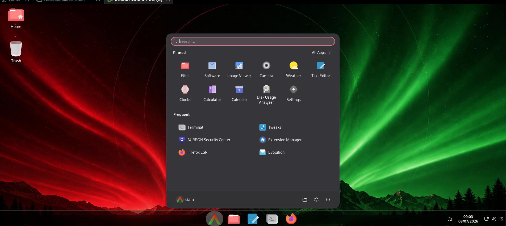

# AUREON OS

> **A modern, Debian-based Linux distribution built for productivity, customization, security, and developers.**


---

<p align="center">
  
</p>
<h1 align="center">AUREON OS</h1>

<p align="center">
A Debian-based Linux distribution with a modern GNOME desktop.
</p>
## Screenshots

### Desktop



### AUREON Security Center


### Application Menu



### Lock Screen

![Lock Screen] (lockscreen.png)
---

## About

AUREON OS is a Debian-based Linux distribution built with live-build, featuring the GNOME desktop environment and the Calamares installer. It is designed for cybersecurity professionals, ethical hackers, penetration testers, students, and Linux enthusiasts who want a modern and secure desktop operating system.

---

## Current Status

**Project Stage:** Pre-release

The project is currently under active development.

**The installation ISO has not been released yet.** This repository contains the development source code and build configuration only. It is intended for development, testing, and contributions while the operating system is being prepared for its first public build.

---

## Features

* Debian-based system
* GNOME desktop environment
* Custom branding and visual design
* Custom wallpapers and themes
* Customized desktop configuration
* Live-build based build system
* Open-source development
* Modular project structure for easier maintenance

---

## Repository Contents

---
├── config/
├── hooks/
├── includes/
├── package-lists/
├── assets/
├── scripts/
└── README.md
```

The directory structure may change as development continues.

---

## Building

The operating system is built using Debian's **live-build** tools.

Development documentation and build instructions will be expanded as the project matures.

---

## Roadmap

* Complete the first installable ISO
* Improve desktop customization
* Refine installer configuration
* Expand documentation
* Improve system stability
* Continue polishing the user experience

---

## Open Source Projects Used

AUREON OS is made possible by the work of many open-source communities and projects, including:

* Debian
* Linux Kernel
* GNOME
* GNU Project
* systemd
* Calamares Installer
* live-build
* GRUB
* Plymouth
* GTK
* Mesa
* NetworkManager

Each of these projects is developed and maintained by its respective community and contributors.

---

## Contributing

Bug reports, suggestions, and contributions are welcome. If you would like to improve the project, feel free to open an issue or submit a pull request.

---

## License

AUREON OS is licensed under the GNU General Public License v3.0 (GPL-3.0).

The source code, build scripts, and original project files in this repository are distributed under the terms of the GNU GPL v3.0.

Third-party software included in or used to build AUREON OS, such as Debian, the Linux kernel, GNOME, GNU utilities, Calamares, and other open-source components, remains subject to its own respective licenses. Those licenses are not replaced or modified by this project.

For the complete license text, see the [LICENSE](LICENSE) file.
---
---

## Acknowledgements

This project builds upon the work of the Debian Project and the wider free and open-source software community. Their continued efforts make projects like AUREON OS possible.

-
